# Azure Active Directory & Security Hardening Lab

## Objective
To design, deploy, and harden a secure enterprise network infrastructure entirely within Microsoft Azure. This hands-on project demonstrates competency in cloud architecture, network segmentation, identity management via Active Directory Domain Services (AD DS), and automation using PowerShell.

## Environments & Tools Used
* Microsoft Azure (Cloud Infrastructure)
* Windows Server 2022 (Primary Domain Controller)
* Windows 10 Enterprise (Workstation Client)
* PowerShell (Automation & Bulk Account Creation)

## Network Architecture
* **Virtual Network (VNet):** `AD-VNet` (10.0.0.0/16)
* **Subnet:** `default` (10.0.0.0/24)
* **Domain Controller Internal IP:** 10.0.0.4 (Static Assignment)
* **Client Workstation Internal IP:** Dynamic (DHCP via VNet)
* **DNS Configuration:** Custom VNet DNS routing traffic through 10.0.0.4

---

## Progress Log

### Phase 1: Cloud Infrastructure Provisioning
*Status: Complete*

1. **Resource Group Isolation:** Created `ActiveDirectory-Lab-RG` to contain all network and compute resources, enabling clean lifecycle management.
2. **Virtual Network (VNet) Topology:** Designed `AD-VNet` utilizing a `10.0.0.0/16` address space with a default subnet (`10.0.0.0/24`) to establish a secure enterprise boundary.
3. **Compute Provisioning:** Deployed a Windows Server 2022 instance named `DomainController` leveraging a `Standard_DC1ds_v3` size (1 vCPU, 8 GiB RAM) to guarantee stable performance for directory operations.
4. **Network Hardening & Static IP:** Modified the Domain Controller's network interface card from a dynamic lease to a **Static Internal IP assignment** (`10.0.0.4`) to maintain consistent DNS resolution.
5. **Custom DNS Routing:** Altered the entire VNet's configuration from default Azure DNS to **Custom DNS**, pointing directly to `10.0.0.4` to ensure future domain client joins resolve correctly.

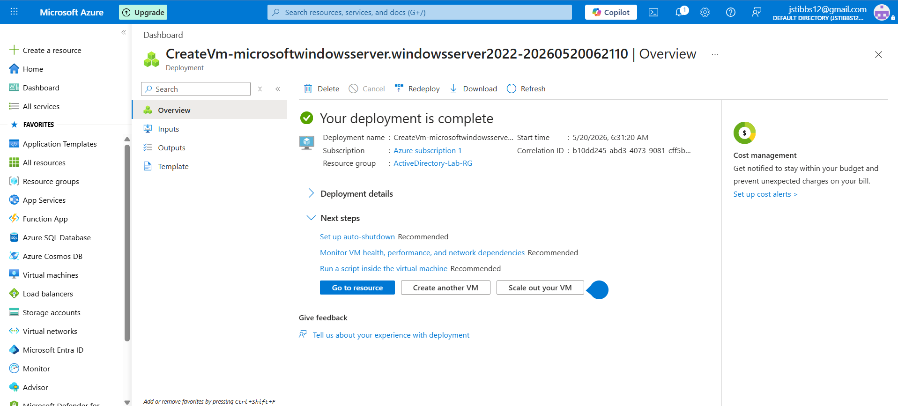
---

## Phase 2: Active Directory Domain Services (AD DS) Installation
*Status: Complete*

1. **Role Provisioning:** Installed the Active Directory Domain Services (AD DS) binary architecture via Windows Server Manager.
2. **Forest Promotion:** Promoted the server instance to a primary Domain Controller, establishing the `labdomain.local` root forest topology.
3. **Automated Provisioning:** Executed an administrative PowerShell automation script to dynamically build out the enterprise tree structure, provisioning core Organizational Units (OUs) including *Information Technology, Accounting, Marketing, Human Resources,* and *Executive*.
4. **Bulk Identity Injection:** Automated the creation of simulated employee corporate accounts, injecting them into their respective departmental OUs with pre-configured secure authentication profiles.

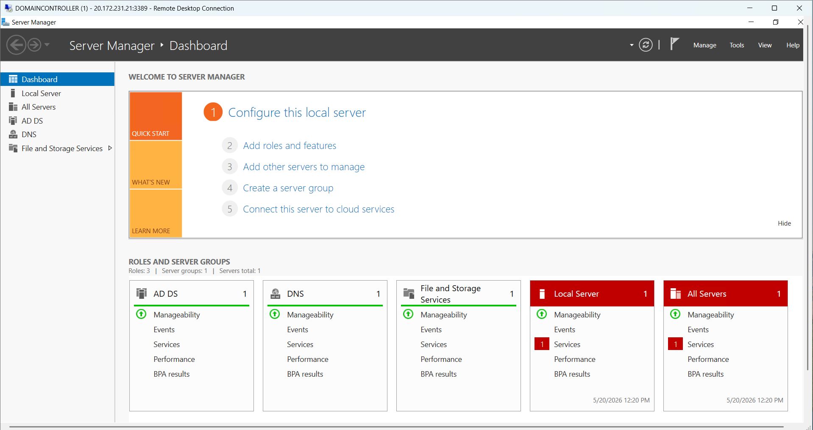
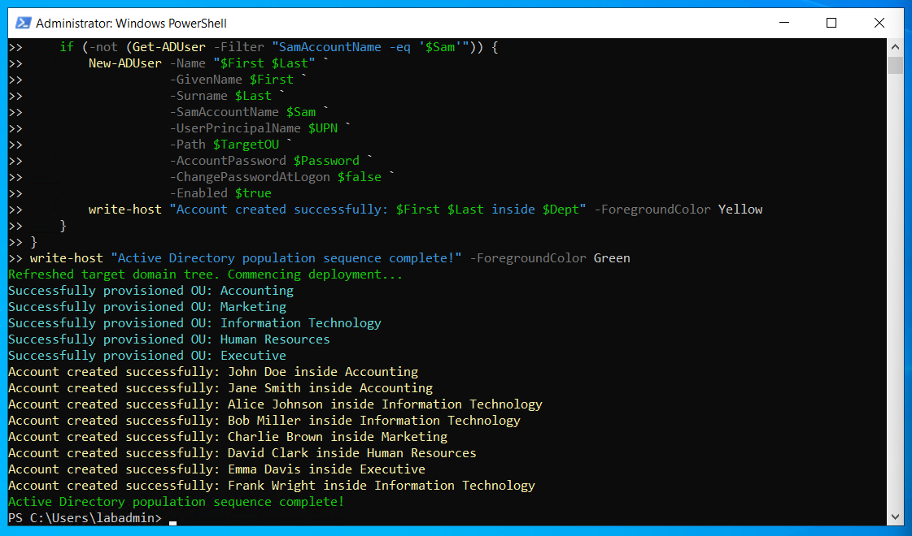
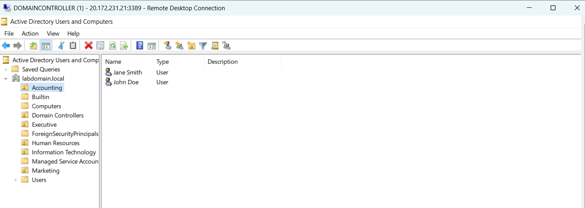
---

## Phase 3: Client Workstation Provisioning & Domain Integration
*Status: Complete*

1. **Client OS Provisioning:** Deployed a Windows 11 Enterprise virtual machine instance named `Client-Workstation` using a `Standard_DC1ds_v3` compute tier to simulate a corporate end-user endpoint.
2. **Network Alignment:** Attached the workstation directly to `AD-VNet`, allowing it to automatically inherit the custom DNS routing pointing to the Domain Controller (`10.0.0.4`).
3. **Enterprise Domain Join:** Modified the workstation's security boundary from a local workgroup to the `labdomain.local` domain. Authenticated using domain administrator credentials to establish a secure trust relationship.
4. **Identity Verification:** Verified successful domain authentication via the `whoami` command-line utility and confirmed the active computer object lease within Active Directory Users and Computers (ADUC).

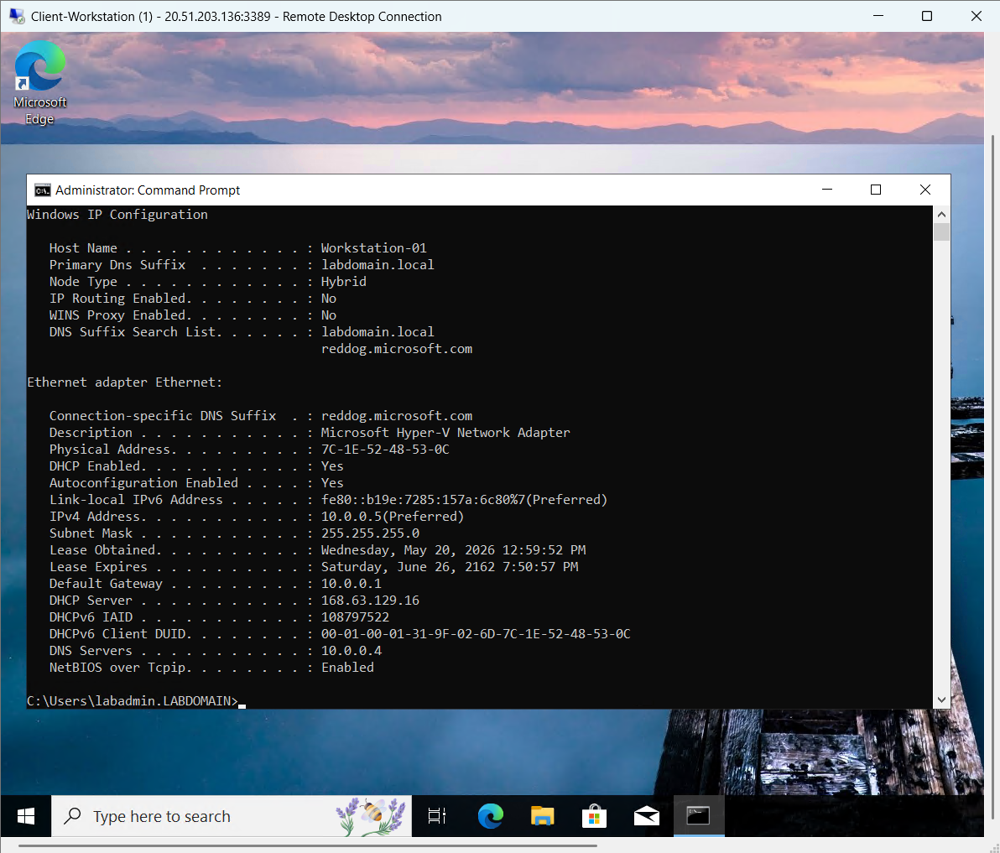
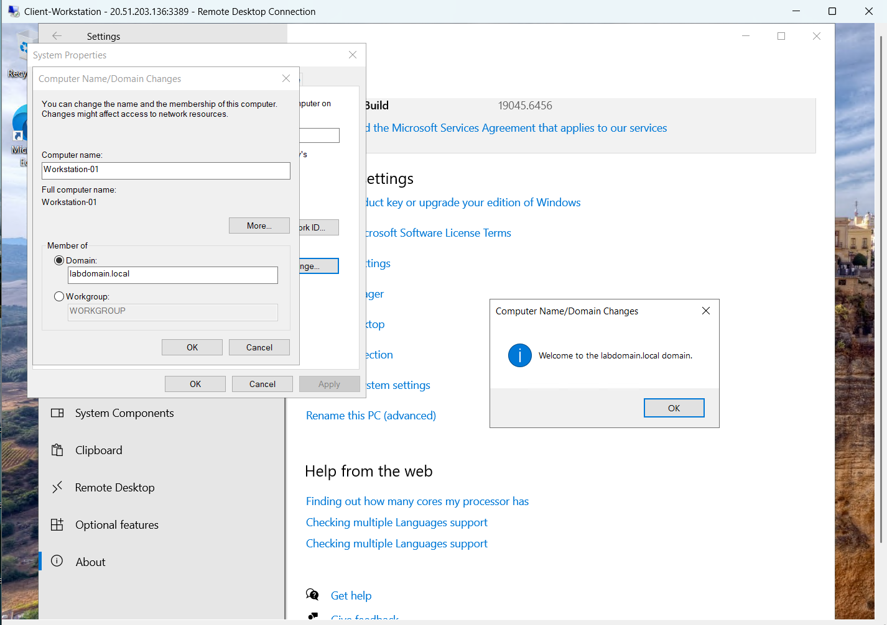
--- 

## Phase 4: Group Policy Object (GPO) Hardening & Security Engineering
*Status: Complete*

1. **Centralized Policy Enforcement:** Utilized the Group Policy Management Console (GPMC) on the `DomainController` to modify the Default Domain Policy, ensuring structural security parameters propagate to all domain assets.
2. **Password Complexity Hardening:** Enforced a strict corporate credential policy requiring a **14-character minimum length** alongside mandatory alphanumeric and special character complexity metrics (aligning with CompTIA Security+ Domain 4.6).
3. **Brute-Force Mitigation:** Engineered an Account Lockout Policy establishing a strict threshold of **5 invalid logon attempts**, dropping a temporary 30-minute lockout block to mitigate automated password-spraying attacks.
4. **Endpoint Verification:** Forced an immediate policy synchronization across the enterprise tree using `gpupdate /force` and verified active local policy parameters on `Workstation-01` via the `net accounts` command-line utility.

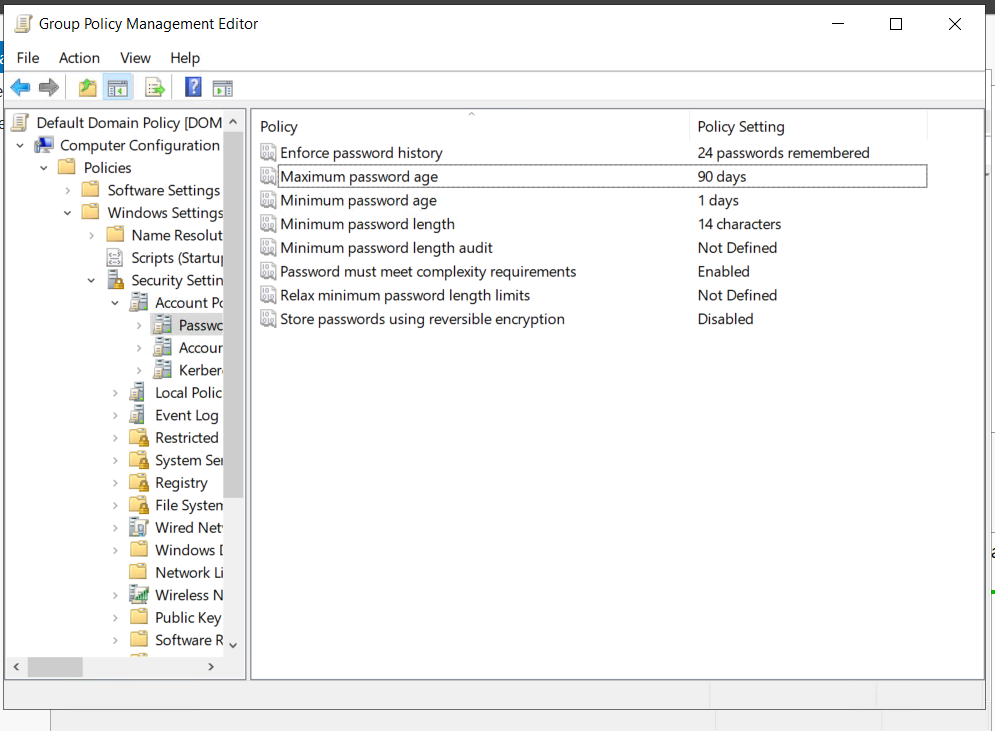
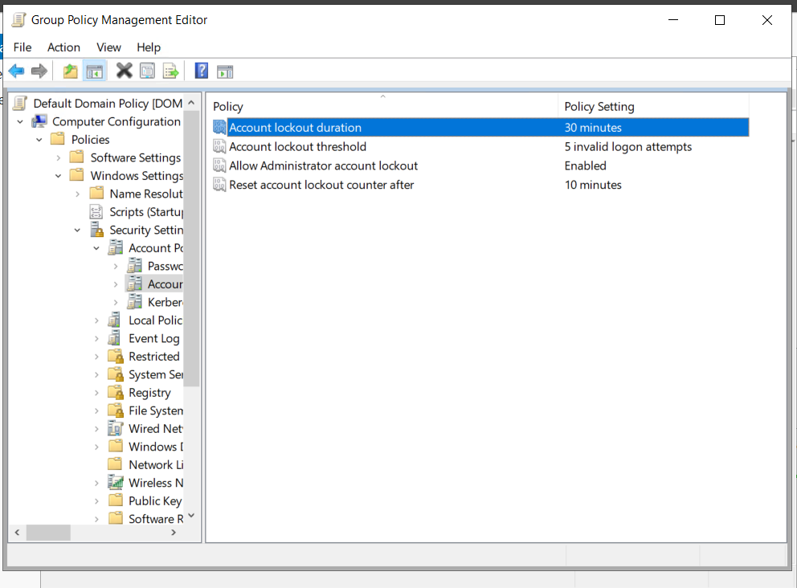
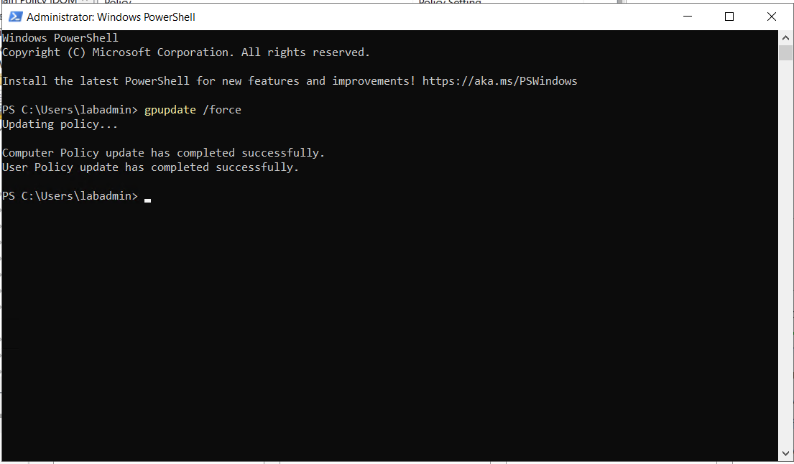
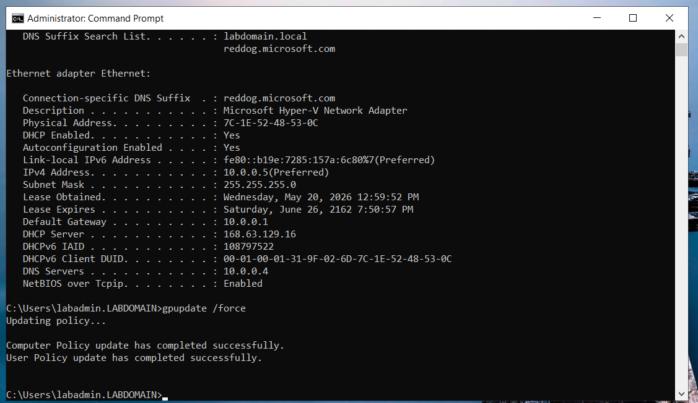
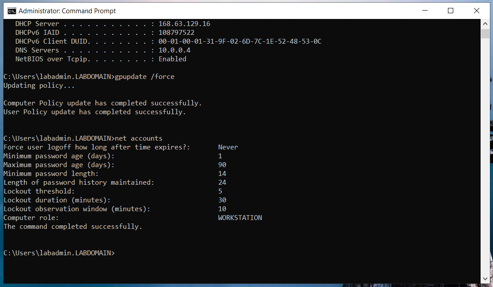
--- 

---

## 👥 Credits & Attributions
* **Implementation & Analysis:** Independent lab execution, environment configuration, and documentation completed by [James Tibbs](https://github.com/jamestibbs12).
